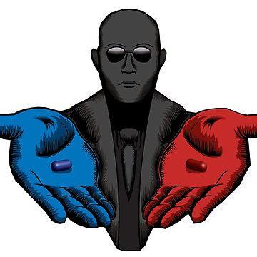

# titre de niveau 1

markdown => sous ensemble du html

## titre de niveau 2

le site internet de création de recette de cuisine les pages suivantes :

- page d'accueil
- page de contact
- page recette
- mentions légales

pour rédiger un article dans le site il faudra :

1. s'être connecté au back office
2. disposer d'un profil gestionnaire
3. rédiger en français en anglais

liste des futures codages :

1. [x] réaliser la page de connexion
2. [ ] créer la base de données
3. [ ] installer PHP

lien hypertexte :

[lien vers google](https://google.fr)

### titre de niveau 3




## afficher des commandes

````

git add .
git commit -m "message"
git push

````

code dans un paragraphe ` git commit `


## paragraphe avec saut de ligne

bonjour comment allez-vous  
ça va bien

---

## liste complète des balises html gérées par markdown

````

h1 h2 h3 ... h6
p br
ul li ol li
img
a
pre code
<imput type="checkbox">
hr

````